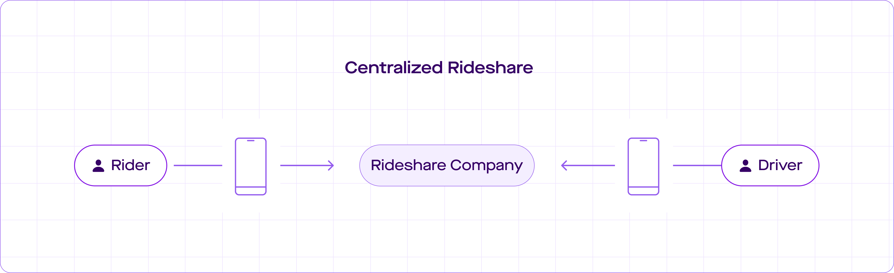
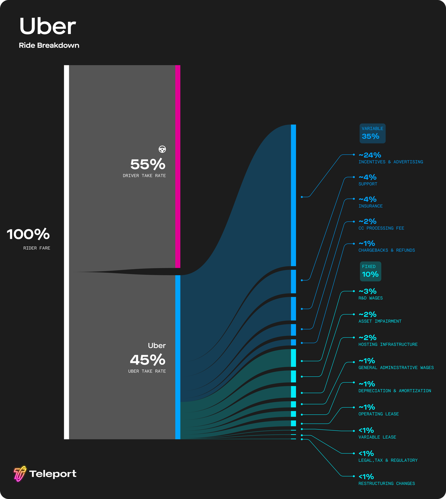
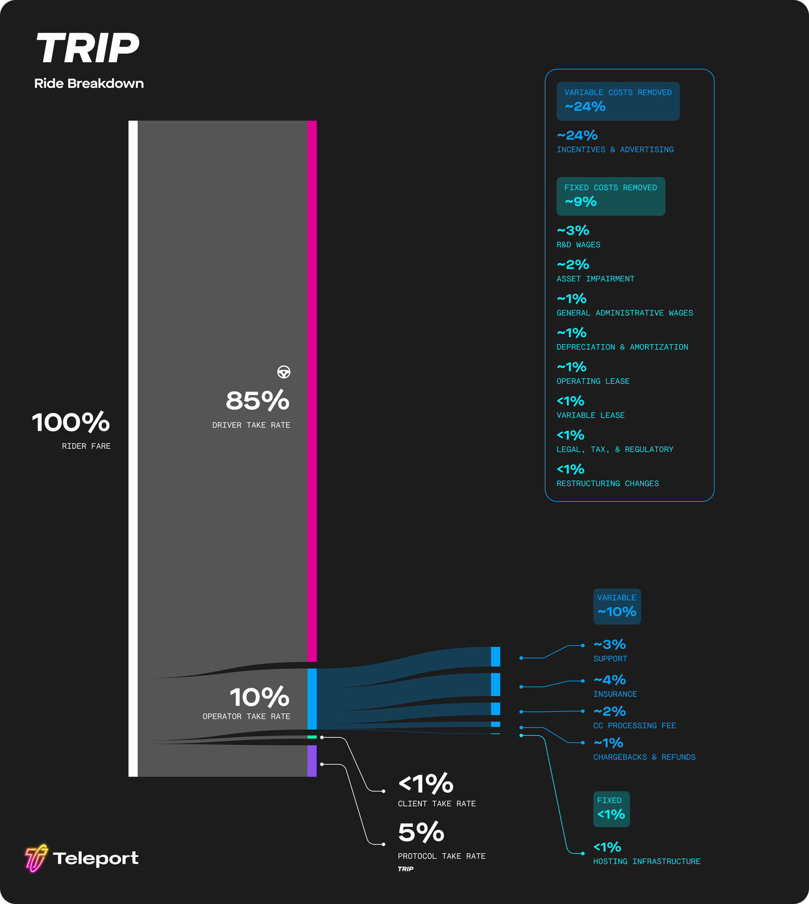
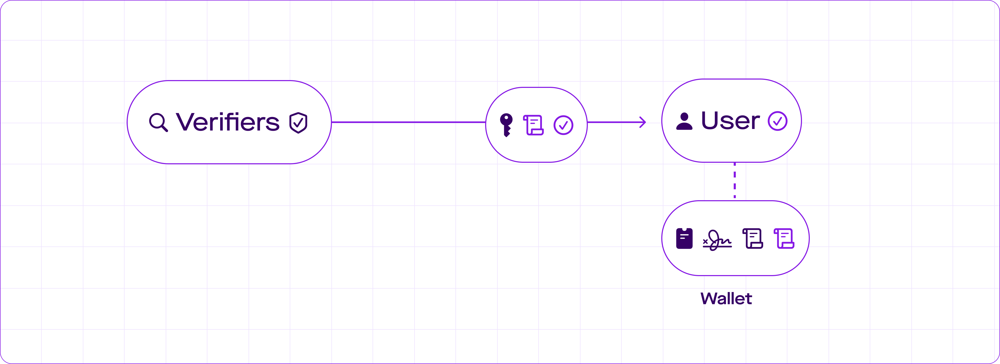
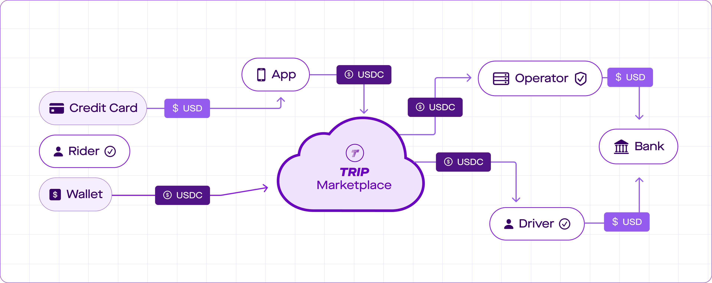

# Litepaper

<figure><figcaption></figcaption></figure>

## 1. Introduction

The internet is an open network: Anyone can start an internet service provider, run a web site, or build an email client. This open structure has led to the world's most dynamic economy: the online economy.

Before the invention of digital programmable money, it was impossible to design open systems for marketplaces such as rideshare, food delivery, and vacation rentals. As a result, middlemen stepped in and charged high fees instead of letting markets set fair prices.

In the rideshare industry, the middleman’s take rate often exceeds 40%. This means that a significant portion of the money paid by customers is taken out of local economies and funneled away elsewhere.

This paper proposes an alternative approach: The creation of a fair and independent marketplace. This marketplace would use an open and interoperable protocol: The Rideshare Protocol (**TRIP**).

TRIP lets small rideshare companies work together. They can then form a global network that benefits drivers, riders, and regional economies. What’s more, the network is self-governed by the participants.

### 1.1 Definition of Rideshare

<figure><figcaption></figcaption></figure>

Rideshare connects drivers with nearby riders. It makes transportation safe, fast, comfortable, and affordable.

The key actors in rideshare are **Drivers** and **Riders**. The rider can provide their location and destination via a **Rideshare App** on their phone. A **Rideshare Company** then looks for nearby drivers who are similarly connected to the app.

### 1.2 Decentralizing Rideshare

In a closed system, rideshare apps from different companies are not compatible. If email worked in this way, users of **Microsoft Outlook** and **Apple Mail** would not be able to email each other. Similarly, if the web were closed, Apple's **Safari browser** would not be able to open **Microsoft's website**. When protocols are closed, like in the case of rideshare, it is difficult for users to switch between different vendors.

Decentralizing rideshare means returning it to the open norms of the internet. In a decentralized system, participants can choose from a variety of apps and servers by many different vendors that communicate with each other.

Centralized rideshare services tend towards preventing the market from setting a fair price. Instead, they set prices themselves and maximize the value they can extract. **Redesigning rideshare as a decentralized system** means more money goes to drivers, riders pay less per ride, and more money stays in local economies.

### 1.3 Companies and Protocols

Many internet applications, including Twitter and Reddit, were initially developed as open systems. Twitter launched its public API in September 2006, leading to a thriving ecosystem of third-party Twitter software that helped the platform succeed. However, Twitter decided to lock down its API in August 2012, once it became large enough to no longer benefit from third-party applications.

Reddit's openness has followed a similar path: thousands of developers created third-party Reddit software over the years, but Reddit has now shut down API access in preparation for its IPO.

Centralized rideshare companies similarly[ have promised good pay and flexibility to drivers but then reneged](https://www.latimes.com/business/story/2021-05-28/uber-flexibility-prop-22) on those promises the moment they were no longer convenient.

For users and developers alike, it is now evident that company promises of remaining fair, neutral, and open cannot be trusted. The solution is to construct genuinely decentralized and provably impartial protocols that are not owned or controlled by any single company, but rather enable all participants to freely collaborate in creating, maintaining, and improving the system.

With the arrival of distributed consensus technology, it is now possible to construct such provably self-governed protocols for marketplaces and online communication systems.

## 2. Marketplace Economics

Marketplaces enable direct competitors to benefit from cooperation with each other. It is no coincidence that in many cities, restaurants of the same cuisine and stores with similar wares cluster together and form neighborhoods. Although these shops still compete on price, selection, and quality of goods and services, they all benefit from increasing foot traffic to their area by working together.

Bringing open marketplace technology to rideshare will unlock the advantages of cooperation for all market participants:

* Drivers receive fairer pay and a say in the governance of the network.
* Riders enjoy better prices, faster rides, and a wider selection of options.
* Regulators have increased ability to positively influence the local transportation market.
* Regional markets retain more money in their local economies.
* Entrepreneurs and businesses have more opportunities to build and innovate on top of transportation infrastructure.

### 2.1 Network Effects and Competitive Moats

When a networked service starts gaining users, its value proposition becomes stronger: more drivers on a rideshare app mean shorter wait times for riders, while more riders mean higher chances of drivers finding a fare nearby. This positive feedback loop is called a _network effect_, and it can fuel rapid growth of a new service.

This strength can also become a _moat_, deterring new entrants from competing in the same space. If a new rideshare service starts up, it'll struggle to attract enough drivers and passengers to achieve the same level of service efficiency unless it heavily invests in incentives to quickly build its user base.

While network effects and moats are often used to justify high valuations for startups that are first to market, in reality, they rarely end up being the ultimate winners, and network effects are frequently disrupted by new entrants.

Understanding how network effects are built was key to first building out the digital frontier. However, now that many markets have matured, it is even more important to understand how network effects can be broken.

### 2.2 Habit and Brand Recognition

Habit, brand recognition, and trust can create strong barriers to entry on their own, but they do not represent good examples of network effects. In the absence of a network effect, a formerly unknown but superior product with better customer experience and/or cheaper prices can still become a competitive threat by first serving a subgroup of users to build trust and brand recognition and then expanding from there.

A moat in the network effect sense requires an advantage that doesn’t derive from the relationship of an individual with the product, but from advantages a service can only garner from having a larger number of users.

For users, the immediately tangible effects of network effects present in just two dimensions:

1. Unit economics: The ability to provide the service more efficiently than smaller competitors,
2. Customer experience: The quality of the service experienced by users is higher than can be provided by smaller competitors.

A moat only protects the incumbent if there is no "bridge": a contiguous and growing set of users that the upstart can serve better than the incumbent, despite its originally smaller size.

### 2.3 Your Margin is my Opportunity

While network effects provide the incumbent with an advantage, operational inefficiencies can negate these advantages. Such operational inefficiencies can include:

* A large headcount in the tens of thousands.
* Excessive corporate debt.
* High customer and driver acquisition cost.

These unfavorable conditions are present in current rideshare incumbents.

<figure><figcaption>
Cost structure of rideshare on legacy rideshare services.
</figcaption></figure>

Cost structure of rideshare on legacy rideshare services.

In[ TRIP Rideshare Economics 101](https://guides.trip.dev/newsletter/rideshare-economics-101) we further explore how the fares differ between legacy rideshare and the TRIP rideshare protocol.

If a new system could establish itself with an initial audience and then grow, its higher operational efficiency would quickly become a threat to the established competition. As the new system grows, the relative advantage of the competition's network decreases, while its disadvantage in operational efficiency remains. This destructive cycle can rapidly become fatal for the outmaneuvered incumbent.

A market-operated rideshare network would be able to operate far more efficiently than current rideshare incumbents, in part because driver and rider acquisition cost could be lowered dramatically by turning all network participants into true entrepreneurs. This will result in better pay for drivers and lower costs for riders.

### 2.4 Building the Bridge

Rideshare companies have fought long and hard to classify their drivers as independent contractors rather than employees. Although drivers theoretically have the freedom to work for other rideshare companies or multiple networks, in reality, network effects have kept them locked into the dominant platform.

If all drivers and riders were to switch services at the same time, they could transition to a more free and fair system. However, such coordination has often been considered impossible.

<figure><figcaption>
Cost structure of rideshare on The Rideshare Protocol (TRIP).
</figcaption></figure>

Cost Structure of Rideshare on The Rideshare Protocol (TRIP)

What is missing is a mechanism to coordinate this switch. We call a tool to enable such social coordination a "Bridge," because it can overcome the moat of a network effect.

Instead of attempting to convince everyone to switch at the same time, a bridge provides an opportunity for those who switch first to help build and take on a larger role in the governance of the network. Voting power on the network is held by TRIP Tokens, which we will describe in more detail later.

A rideshare marketplace that is fairer, with the participants - not middlemen - in control, is not just a better system. It also has the potential to become a social movement and spread like one.

## 3. Rules and Decisions

Marketplaces, even those located in town squares, have always been subject to rules, whether they be noise ordinances or regulations regarding waste management. Customers won't visit a marketplace that's not clean and safe, so good governance is essential for a thriving marketplace. However, network effects and moats can put marketplaces in a privileged position where owners may favor their own interests over those of vendors and customers.

Since a marketplace requires rules, the question of who creates those rules on a decentralized marketplace arises. While concentrating governance in a single company may work in the short term, monopolists are likely to abuse their power in the long term. The ideal scenario would be for the governance of the network to be in the hands of its most active participants. However, the most active participants on a network are constantly changing — new participants join and old participants leave.

### 3.1 Self-Governance (TRIP Tokens)

The TRIP Network is governed by holders of TRIP Tokens. TRIP Tokens are fungible tokens that represent participation and voting power in the network. TRIP Tokens will be issued once the network is sufficiently decentralized and stable.

General governance including protocol upgrades, changes to authorization-flow, the change of fundamental network parameters all require voting by the Token-holders.

### 3.2 Network Incentives (TRIP Rewards)

<figure><figcaption></figcaption></figure>

TRIP Rewards are digital collectibles that are issued to individuals as a reward for contributing to the health and growth of the network. Unlike TRIP Tokens they have no voting power and are not involved in the governance of the network.

TRIP Rewards are represented as NFTs commemorating actions such as taking a first trip, inviting users, or riding in a new city, while others are issued to those who contribute the most to the network within a certain time span.

### 3.3 Reward Issuance

.png>)

One way to obtain TRIP Rewards is by participating in a weekly competition to contribute the most to the health and growth of the network. These weekly rewards are created on a fixed issuance schedule, with new weekly rewards minted in each epoch (7 days in block time) and automatically distributed to the most active network participants.

These rewards can go to all the different entities that are required to make a ride happen:

* Drivers
* Riders
* Balancers
* Verifiers
* Auditors
* Operators
* Apps

### 3.4 Sybil Protection Fee

In protocol design, a sybil attack is an attempt by an individual to manipulate the network by creating multiple fake identities or transactions.

The TRIP protocol requires a sybil fee to be paid to the TRIP Marketplace on every transaction on the network. This fee is necessary for the transaction to be considered valid. Transactions are conducted in national currency stablecoins and we’ll go deeper into the payment flow in future sections.

The TRIP Marketplace holds the Sybil fee, to be exclusively controlled by the network's governance (using TRIP Tokens).

In future iterations of the protocol, the USDC Sybil fee could also potentially be used to finance the automated acquisition of gas for the blockchain the protocol utilizes, as well as to facilitate the automated payment of other various blockchain operations.

### 3.5 Network Growth

To create a decentralized rideshare marketplace that can compete with centralized rideshare companies, the network needs widespread adoption and a healthy balance of drivers (supply) and riders (demand).

A key condition for incentivizing adoption is to operate with lower overhead costs compared to centralized rideshare companies. By creating a network of local rideshare companies powered by free open-source software, drivers can earn more and riders can pay less. Moreover, the fees paid to these rideshare companies will circulate in their respective local economies instead of being siphoned off to multinational corporations.

To accelerate network growth even further, the system continuously issues TRIP Reward digital collectibles to the most active and supportive participants. This additional issuance is called the balancing mechanism.

Users who invite other users (drivers or riders) to the network are called Balancers. When a ride is completed, the system keeps track of all the entities involved in making the ride successful. All completed transactions on the network are counted towards this balancing mechanism.

Balancers are especially involved in building community and helping other drivers, riders, and balancers understand the system and onboard into the system.

New TRIP Rewards are issued at the end of each epoch to all entities based on the amount of transaction volume they contributed to during that epoch.

### 3.6 Decentralization

Initially the protocol will be operated while relying on centralized development and operation.

Once a decentralization milestone has been achieved the governance of the network can be handed over to the community running the network by issuing TRIP Tokens.

After decentralization has been achieved the protocol can be upgraded by the means of democratic governance by the network participants.

### 3.7 Protocol Upgrades

Future software upgrades for the TRIP protocol will be adopted through governance mechanisms that use a decentralized proposal process. This process allows community members to actively shape the protocol's future, rather than a single organization or company controlling the network.

We believe that a robust and fair governance structure is key to the protocol's success. TRIP Token holders will have the ability to create and vote on proposals for protocol improvements. This decentralized approach ensures that the platform remains flexible and adaptive to the changing needs of its users, incorporating diverse perspectives and ideas.

## 4. Protocol Design

The operation of the decentralized rideshare network involves the following entities:

1. **Riders** and **Drivers** are **Users** who connect to the protocol to offer or request rides using **Rideshare Apps**. These apps are the equivalent of a web browser or email client.
2. **Operators** handle the regulatory and operational requirements of providing rideshare service. They are powered by **Rideshare Server** software which is comparable to a web or email server. Depending on the applicable local regulatory framework, an Operator may serve as Transportation Network Company (TNC) or Transportation Network Provider (TNP) or Fleet Manager.
3. The **TRIP Marketplace** consists of a set of blockchain smart contracts that offer coordination and consensus services to the rideshare network. These smart contracts are governed by a Decentralized Autonomous Organization (DAO) of TRIP Token holders and help the network remain neutral and fair without having to rely on centralized authority.
4. **Balancers** are network participants that help the TRIP Marketplace overcome supply/demand imbalances by inviting additional drivers and riders.
5. **Verifiers** are entities who inspect driver licenses, perform car inspections, conduct background checks and verify phone numbers.
6. **Auditors** are entities that are capable of confirming the legal and operational readiness of both Verifiers and Operators.

Once verified, any entity that is capable and legally permitted of performing a role can fulfill that role within the system.

### 4.1 Key-Centric Identity

All entities on the network are uniquely identified by a public/private key pair that they self-generate.

Entities use their keys to identify themselves, authenticate connections, sign messages, and store USDC and other digital tokens, as well as certificates associated with their public key.

### 4.2 Attestations

Entities can make statements about each other by signing statements about the public keys of other entities. These statements can be made either on-chain or off-chain.

### 4.3 The TRIP Marketplace

The TRIP Marketplace is a set of smart contracts that run on a blockchain. It provides consensus, coordination, and governance services for all other components of the rideshare network.

### 4.4 Network Authorization

.png>)

In order to comply with legal and regulatory requirements, maintain high safety standards, and ensure customer satisfaction, all rideshare network participants must undergo an authorization process appropriate for their role before being granted access to the network.

The TRIP Marketplace is democratically governed by network participants and holds ultimate authority on the network. Through voting on the TRIP Marketplace, the authority to make attestations can be temporarily and revocably delegated from the TRIP marketplace to dedicated Auditors and Verifiers.

An Auditor is a firm or individual authorized by the governance of the TRIP Marketplace to verify that Operators and Verifiers are legally permitted and operationally capable of fulfilling their assigned roles on the network.

A Verifier is a service or entity that validates claims or assertions made by users or entities within the decentralized ecosystem. Verifiers play a crucial role in establishing trust and credibility when traditional centralized authorities are not present.

#### 4.4.1 On-Chain Authorization

Verifiers must be in legal and operational compliance with all applicable regulations and laws before they begin providing attestation services to the network.

Operators must obtain licenses and insurance, and be operationally prepared to comply with regulatory and safety requirements in each geography they wish to serve, before they can begin matching riders and drivers within those locations.

To ensure that Verifiers and Operators are compliant with local regulation and operational requirements, the TRIP Marketplace votes to deputize dedicated auditing firms. These firms receive authorization by multi-sig keys to sign off on the regulatory and operational readiness of Operators and Verifiers.

Once Operators and Verifiers have been approved by a majority multi-sig vote, they are publicly listed on the contract together with their public key and DNS address, as well as additional metadata such as geographic zones of operation.

#### 4.4.2 Certificate-Based Authorization

While Operators and Verifiers are authorized on the blockchain, drivers and riders (users) are authenticated off-chain to preserve privacy and control.

After a Verifier has completed the certificate-based authorization flow, the user's rideshare app receives certificates that they can use to prove their authorization with a high level of precision and control. Types of authorizations include background checks, driver licenses, car inspections, and any other credentials required for legal operation.

For example, if a user’s rideshare app requires a certificate to prove that its phone number has been verified, they can contact a Verifier capable of providing that service. After the usual public key-based handshake described earlier, the Verifier then sends a text message with a code to the user’s phone number.

After the user enters the correct code in either the ride share app or on a dedicated website, the phone number Verifier confirms that the phone number has been verified by transmitting two signed certificates to the user’s rideshare app:

1. A signed certificate stating that “\<Verifier PubKey> has established on \<Date> that \<User PubKey> has a valid phone number.”
2. A signed certificate stating that “\<Verifier pubKey> has established on \<Date> that \<User PubKey> has a valid phone number, and that this phone number is +1 (415) 000-9999.”

Having received two separate certificates, the user’s app is now in a position to choose whether to prove that their phone number has been verified, or that a specific phone number has been verified for their use, without having to resort to Zero Knowledge Proof techniques. Certificates have an expiration date and can be revoked through a certificate revocation list.

The user is now verified through the Verifier and can prove to any other entities that their phone number has been verified, without needing to disclose the phone number to other protocol participants.

### 4.5 Ordering a Ride

Once at least one Operator and enough Verifiers have been approved to operate within a specific geographic area, the system is considered live in that area.

#### 4.5.1 Secure Connection Establishment

When two entities establish a direct network connection, they use their keys to establish an encrypted and mutually authenticated session. The session is protected against impersonation, man-in-the-middle, and replay attacks.

During connection establishment, Operators validate that Drivers and Riders have passed all necessary checks, while Drivers and Riders validate that the Operator has been approved for operation in the region. Upon a successful match by the Operator, Drivers and Riders again verify each other's credentials before beginning a ride.

The multiple redundancies in this process help ensure that rides established via the TRIP protocol are legal and insured, and that drivers and riders are vetted.

#### 4.5.2 Service Area

Both riders and drivers can connect to all Operators that are licensed to operate in or near their current geographic region.

Riders can query all applicable Operators for offers. Depending on local insurance, regulatory, and practical requirements, Drivers can be connected to and/or online with one or more Operators at the same time. Drivers can further instantly deactivate their active status with one Operator and switch to another. The specific policy and triggers for switching are up to the rideshare app, but most handovers are expected to happen organically without user intervention.

For example, automatic switching from one Operator to another can occur when crossing state or country lines. Once the driver app crosses a service area border, the rideshare app will automatically become active with an Operator licensed in the newly entered state or country.

In the United States the Interstate Commerce Clause (Article 1, Section 8, Clause 3 of the U.S. Constitution), the Full Faith and Credit Clause (Article 4, Section 1), and the Real Interstate Drivers’ Equity (RIDE) Act (48 U.S.C. 14501(d)) ensure that drivers can drop off customers in states other than the one where the initial pick-up contract was established.

#### 4.5.3 Supply & Demand Indication

Once drivers and riders are connected and their credentials are validated by a local Operator, drivers can indicate that they are available to accept rides (supply indication), and riders can request rides (demand indication).

After going active, the driver's rideshare app regularly updates the driver's location with its active Operator.

#### 4.5.4 Matching & Pricing

.png>)

When an Operator with active drivers receives a ride request from an eligible rider it checks the location of nearby drivers and uses its internal pricing engine to prepare an offer to both drivers and riders. Offers include both pricing and ETA estimates. Drivers get offers only from their active Operator, but riders get offers from all validated and licensed Operators in the geographic area. The pricing offered to both drivers and riders need to be mutually accepted before a trip is established. All pricing information and the take-rate of all involved entities is fully transparent to all participants.

#### 4.5.5 Payment Rails

Payments on the rideshare protocol (TRIP) are made using national currencies, such as the US dollar. The system - as much as is possible - supports both traditional payment methods such as credit cards and bank transfers, as well as newer payment methods like stablecoins backed by national currencies.

Bank transfers (ACH, FedWire) and credit card payment systems were originally designed between the 1910s and 1960s. As a result, they lack the necessary capabilities to fully interoperate with decentralized marketplaces designed in the 2020s. To bring the stability and security of national currencies, such as the US Dollar, to the rideshare network, TRIP utilizes stablecoins. Stablecoins are digital equivalents of national currencies that can be used on modern open, programmable protocols such as TRIP. One such stablecoin is USDC.

In the context of the TRIP protocol, USDC or other stablecoins are used as modern payment rails for the US dollar. Most payments within the TRIP protocol are made in USDC, or in other countries, using comparable, well-regulated, local-market stablecoins. TRIP rideshare apps on mobile phones include software (a digital wallet) to directly store stablecoin balances. This gives users complete control over their funds without requiring any intermediaries or exposure to exchange rate risk.

#### 4.5.6 Payment

When booking a ride through a mobile app, users have several payment options. They can directly use USDC from their digital wallets, refill their digital wallets with the help of a licensed money transmitter, or pay a booking or aggregation agent by credit card or bank transfer to assist with the booking process.

As soon as the customer begins searching for a ride, USDC funds that cover the ride are placed into an escrow program on the TRIP Marketplace.

After the ride concludes, funds from the escrow are used to settle balances with all entities that receive a payout from the ride. Payment flows will generally follow a broad overarching pattern, but may differ slightly between jurisdictions to comply with local regulations.

If the user decides to use a booking or aggregation agent to help book a ride and pay with a credit card or bank transfer, the payment process is similar to the non-custodial flow. The booking agent charges its own fee structure for assisting the customer in securing a ride and assumes all risk for the credit card or bank transfer transaction with the customer and then uses its own segregated USDC funds to order a ride to fulfill its booking contract with the customer.

Since the purchase of a ride by a customer is a normal e-commerce transaction, additional customer identity verification before the credit card transaction is optional and depends in part on the comprehensive risk-management strategy of the booking agent, since they are liable for any and all chargebacks. All recipients of funds (drivers, service providers) are always fully background checked which reduces the potential for fraud.

If a customer wants to refill USDC for direct use in their non-custodial wallet, additional identity verification is required to comply with Anti-Money-Laundering (AML) and Know-Your-Customer (KYC) regulation.

Drivers are always paid in USDC to their non-custodial USDC wallets. The developers of the iPhone and Android apps can work with licensed money transmitters to facilitate withdrawals to drivers' bank accounts via ACH.

If the money transmitter accepts TRIP certificate credentials, it is possible that the driver background checks that were already conducted for passenger safety can be reused by the licensed money transmitters to facilitate ACH withdrawals.

#### 4.5.7 Ride Conclusion

At the end of a ride, the contract settles all outstanding payment balances out of escrow. Both the rider and driver apps report information, including the estimated time of arrival (ETA) and actual ride time, back to The TRIP Marketplace. The TRIP Marketplace can use this information to ensure that Operators provide accurate ETA estimates.

The Operator is fully responsible for compliance with local legal requirements around the collection and reporting of trip data points (such as pick-up/drop-off location, total fare, time of booking, number of passengers, wheelchair accessible requests and fulfillments). This is only necessary in jurisdictions where local law or regulation requires such reporting.

Driver, Rider, and Operator ratings are optionally reported to a rating aggregation service as signed proofs. In the future, zero-knowledge-proofs will be used to remove reliance on aggregation services while preserving privacy for all participants.

#### 4.5.8 Dispute Resolution

Operators are responsible for the trips they facilitate and are required to conduct background checks on both riders and drivers before facilitating a match. The TRIP protocol enforces this by ensuring that both Operator and the driver/rider they are matched with are licensed, insured, permitted to operate in their geographic target area, and have passed a background check.

Operators who operate using the TRIP protocol are subject to the same requirements as any other rideshare operator. This includes full compliance with all applicable local regulations and laws, handling customer support requests, and cooperating with law enforcement. Operators also have the final say in resolving disputes and issuing refunds, in compliance with applicable laws and regulations.

To join the network, Operators must establish mechanisms for registering and responding to customer requests and complaints. This process is validated by dedicated compliance auditing firms that review their applications before verifying them via on-chain authorization.

Operators that underdeliver on customer support, provide bad estimated times of arrival (ETAs), or are negligent of their duties to comply with safety regulations and ensure the well-being of drivers and riders will be penalized by the TRIP Marketplace or even removed from the network.

Increased competition, closely tracked ratings, and enforcement of high standards by The TRIP Marketplace compel Operators to deliver higher-quality service. Unlike in a centralized monopoly, riders and drivers have plenty of alternative options to choose from.

#### 4.5.9 Privacy

TRIP's architecture is carefully designed to select which data is transmitted to which party and where control over the data is located. Data is only shared with the minimum subset of recipients required for legal, safety, and technical reasons.

Transaction and identity-related data never come into contact with a blockchain or any other public repositories. Payments do occur on the public ledger but contain no information about destinations beyond what any normal blockchain payment would reveal.

The public nature of ledger technologies is known to have privacy implications, which have been thoroughly studied and researched. It is possible and reasonable to reduce information leakage from blockchain transactions in the future by introducing privacy-enhancing zk-SNARK technologies, and we do believe that this will be an important addition to future protocol versions.

## 5. Conclusion

In this paper, we’ve introduced **TRIP**, The Rideshare Protocol, an open and decentralized alternative to centralized rideshare services. TRIP's design provides for on-chain governance and compliance with local regulatory environments.

With slight modifications, this approach could be applied to a broad range of online marketplaces. As the field develops, we expect that many of the necessary components we’re developing will become interoperable across various protocols. A lot of what we have pioneered with TRIP will also be relevant to developers of future decentralized food delivery, courier service, vacation rental, and auction marketplaces. Some of these marketplace functions could potentially even be served by extensions of the TRIP Marketplace framework.

We welcome feedback and contributions and are looking forward to the launch of the first TRIP services, servers, and mobile apps.


#### Feedback

You're encouraged to help improve the quality of this guide.

Please contribute if you see any typos or factual errors. To get started, you can read our [Contributing to TRIP](https://guides.trip.dev/contributing/contributing-to-trip) section.

You may also find incomplete content or stuff that is not up to date. Please do add any missing content by [creating a free account in GitBook](https://app.gitbook.com/invite/0WSd8UiSeH2xhfJrSbUr/YFiygcuBiy7oN3WJyDRs). Check the [TRIP Guides Guidelines](https://guides.trip.dev/contributing/guides-guidelines) for style and conventions.

If for whatever reason you spot something to improve but cannot do it yourself, please [open an issue](https://github.com/TeleportXYZ/TRIP-Guides/issues/).

And last but not least, any kind of discussion regarding TRIP documentation is very welcome in the [official TRIP Community on Telegram](https://trip.dev/chat).

