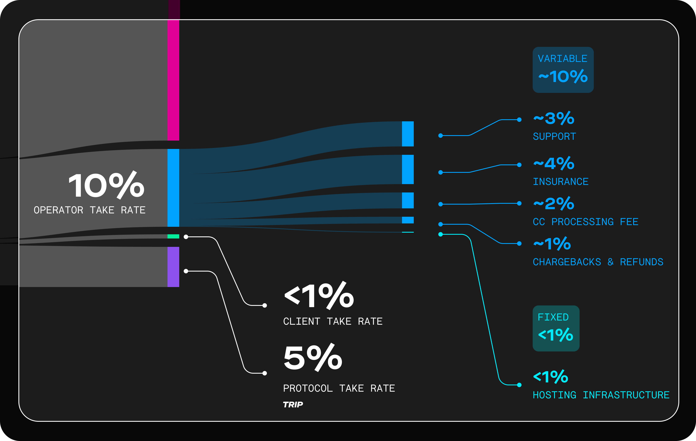

# Rideshare Economics 101

On the surface, riding with TRIP is familiar. If you have ever used Uber, it works the same way. You open the app, enter your destination, get in a car, and go.

<figure><figcaption></figcaption></figure>

So you might be wondering, if TRIP is so much like Uber, why is it getting so much attention? What’s different about TRIP that makes it standout?

Well, despite the surface-level similarities, TRIP is a new kind of rideshare. With TRIP, you pay less for a ride. A lot less. And at the same time, your driver earns more. Much more.

Why? Because Uber takes 44% of what you pay for a ride while TRIP takes only 15%.

**Here’s how it works:**

Traditional rideshare companies spend a lot on recruiting riders and drivers, among other things. This extra cost increases what you pay for a ride and reduces what your driver takes home.

Our approach is different. With our approach, we spend almost nothing on recruiting. And we remove many of the extra costs traditional rideshare companies face.

Instead, we use onchain rewards to motivate early adopters to recruit new users. Lots of new users. And as well, we use onchain rewards to motivate users to help operate TRIP around the world.

The result? We save money. A lot of it. And we split those savings between you and your driver. You pay less for your ride. A lot less. And your driver takes home more. Much more.

<figure><figcaption></figcaption></figure>

Want to know exactly how these costs breakdown for Uber vs TRIP? Read on to learn more.

### When you take a ride, where does the money go?

<figure><figcaption></figcaption></figure>

 

<figure><figcaption></figcaption></figure>

Let’s say you are taking a $50 ride to the airport. Where does your $50 go?

We did the research to find out exactly that.

### Uber’s biggest expense

Let’s start with Uber. We analyzed their public filings and gathered insights from industry experts. And from that, we found that about 24% of your $50 fare goes to “Incentives & Advertising”.

<figure><figcaption></figcaption></figure>

This cost is how much Uber spends to attract new drivers. And they do this so that the rider experience is as good as they can afford to make it. Without this cost, you would be less likely to get an Uber ride when and where you want without waiting a long time.

Why does Uber spend so much to attract and keep drivers?

It’s because of a few factors:

1. Uber drivers feel they aren’t paid well.
2. Because they feel that way, they don’t drive for long.
3. Because drivers don’t drive for long, Uber offers cash bonuses to attract new drivers.

And those cash bonuses come out of existing drivers’ earnings.

Which leads Uber drivers to feel they aren’t paid well. And the cycle continues.

<figure><figcaption></figcaption></figure>

Uber has reached somewhat of an equilibrium with this model. That said, it’s a vicious cycle.

And it comes at an immense cost of driver loyalty and goodwill.

### How TRIP sidesteps Uber’s biggest expense

Now let’s take a moment to look at TRIP.

With TRIP, none of your $50 fare goes to “Incentives & Advertising”.

<figure><figcaption></figcaption></figure>

That’s right, TRIP spends nothing to attract and keep drivers.

And TRIP is able to do so without sacrificing your experience as a rider.

How does TRIP solve this?

It’s because of TRIP’s onchain rewards and how they work:

1. If you refer others to TRIP, you earn TRIP Rewards.
2. To some people, TRIP Rewards are as attractive, if not more so, than cash bonuses.
3. So, TRIP Rewards motivate people to refer drivers to where they are most needed.

<figure><figcaption></figcaption></figure>

TRIP Rewards cost almost nothing to issue. So we can remove “Incentives & Advertising”.

And because we can remove this expense:

1. Drivers earn more of each fare.
2. More drivers feel they are paid fairly.
3. And fewer drivers stop driving in the first place.

What’s more, by driving with TRIP, you also earn TRIP Rewards.

And so the more you drive with TRIP, the more committed you become to TRIP’s success. Which again, means even fewer drivers stop driving in the first place. So by removing “Incentives & Advertising” alone, TRIP brings the driver take rate up to 79%.

For our second biggest cost savings gain, let’s look at Uber’s fixed costs next.

### Uber’s fixed costs

<figure><figcaption></figcaption></figure>

Uber’s fixed costs are costs that do not change with the number of rides taken on their network.

From our research, we found that about 10% of your $50 fare goes to their fixed costs. These costs include real estate, 32,800 employees and interest payments on $9.5 billion in debt. So as you can see, overhead balloons as a traditional rideshare company grows.

What happens when you replace a traditional rideshare company like this with an open protocol like TRIP? Many of these fixed costs completely go away.

Let’s look at exactly how that happens now.

### How TRIP avoids Uber’s fixed costs

TRIP is able to avoid Uber’s fixed costs because it is an open protocol.

What is an open protocol? Well first, a protocol is a way computer programs talk with each other. And a protocol is open when the computer programs don’t need permission to talk together.

For example, the web is an open protocol. Any web browser can “talk to”, or view, any website.

And because of this, open protocols like the web, allow for permissionless building. Meaning anyone with the technical knowhow can build a website and add it to the web.

<figure><figcaption></figcaption></figure>

Due to permissionless building, some of the most valuable businesses start on open protocols.

Amazon, Google and Facebook, for example, were built on the open protocol of the web. And as the open protocol of the web grew, these businesses grew with it.

In the case of Google, the more people use the web, the more people search the web. And the more people search the web, the more Google’s business grew. And since Google wants to grow, Google wants to get more people using the web.

And so to get more people using the web, Google invests directly in supporting the web itself. And Google isn’t the only one who does this. Millions of institutions invest in supporting the web.

As a result, the web has little to no fixed costs. An open protocol turns the fixed costs of a would-be closed system into investments.

The investments of the businesses built on top of the protocol. So using the same reasoning, TRIP also has little to no fixed costs. TRIP turns the fixed costs of the closed system of Uber into investments.

The investments of the businesses built on top of TRIP.

### TRIP’s greater efficiencies

Now, what kind of businesses are built on top of TRIP?

Beyond driving, there are two worth noting at the moment: Clients and Operators. Clients are companies that create software for riders and drivers to access TRIP. For example, Teleport, the mobile app, is TRIP’s first Client.

<figure><figcaption></figcaption></figure>

Operators match drivers and riders for trips.

<figure><figcaption></figcaption></figure>

By observing all local laws, they protect riders and drivers as trips take place.

<figure><figcaption></figcaption></figure>

Clients and Operators can both set their own take rates.

That said, anyone can become a Client or Operator on TRIP. As a result, Clients and Operators have an incentive to provide quality service at a fair rate.

If they don’t, drivers and riders will move to other Clients or Operators on TRIP.

<figure><figcaption></figcaption></figure>

What’s more, Clients and Operators receive TRIP Rewards when facilitating rides.

So, the more rides they facilitate, the more committed they become to TRIP’s success. Which again, creates a healthy incentive for them to provide a good service at fair prices.

Given this:

* About 10% of your $50 fare goes to the Operator when riding with TRIP.
* And less than 1% of your $50 fare goes to the Client.

### What’s next

Now with TRIP, what happens to the remaining 90% of your $50 fare?

<figure><figcaption></figcaption></figure>

About 5% goes to the TRIP protocol itself. This fee protects and sustains the protocol.

And the remaining 85% of your $50 fare goes to the driver. So in this hypothetical scenario, instead of earning $27.50, our driver would have earned $42.50. That’s a 55% increase.

Now, it’s important to note that these are averages.

And they are forecasts based on our best estimates. Moreover these are our best estimates of what TRIP’s costs and efficiencies will look like at scale. In other words, our best estimate is that, at scale, on average the driver’s take rate will be 85%.

Between here and there, there is a lot of good, meaningful work to do. We will make it happen.

We hope this inspires you (yes you) to help us realize this vision. The sooner everyone knows what we've created, the sooner you'll be paying less for your rides and your driver will (finally) be getting paid their fair share. So, join us. Spread the word far and wide.

Together, we will free the rideshare market once and for all.

Carpe Viam.


### Whenever you're ready, there are 4 ways to get more involved:

1. [Download the App](https://apps.apple.com/us/app/teleport-request-a-ride/id1607881031): Ride and drive on the TRIP network with the Teleport app. Teleport is available on iOS. We don’t have a release date for Android we can share yet but it’s important to us and on our radar. [Join the waitlist here](https://www.teleport.xyz/waitlist).
2. [Join the TRIP Community](https://trip.dev/chat): Join 1,331+ members and get exclusive tips, strategies, and resources to help you free your local rideshare market so that riders pay less, drivers earn more and early adopters get rewarded.
3. [Contribute to TRIP](https://github.com/TeleportXYZ/TRIP-Guides/issues/): Join dozens of contributors by proposing, creating, and editing content that helps us all share TRIP more clearly and effectively with newcomers. Contribute long form guides, social posts, memes, and more.
4. [Bring TRIP to your city](https://explorer.trip.dev/): See the progress to bringing TRIP to your city with the TRIP Explorer. Check back regularly as more features and updates are added.

