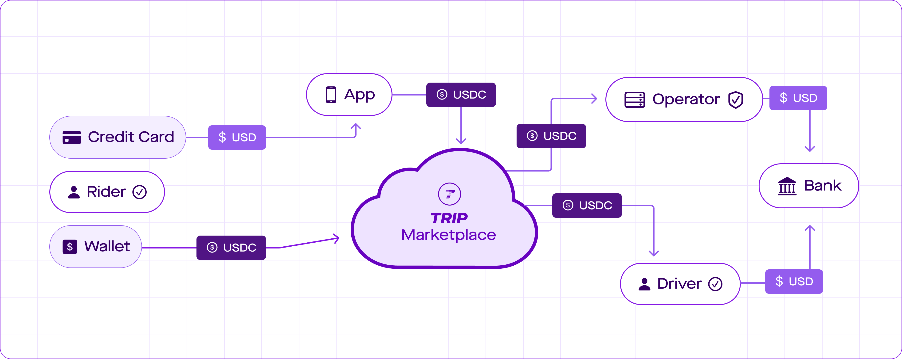
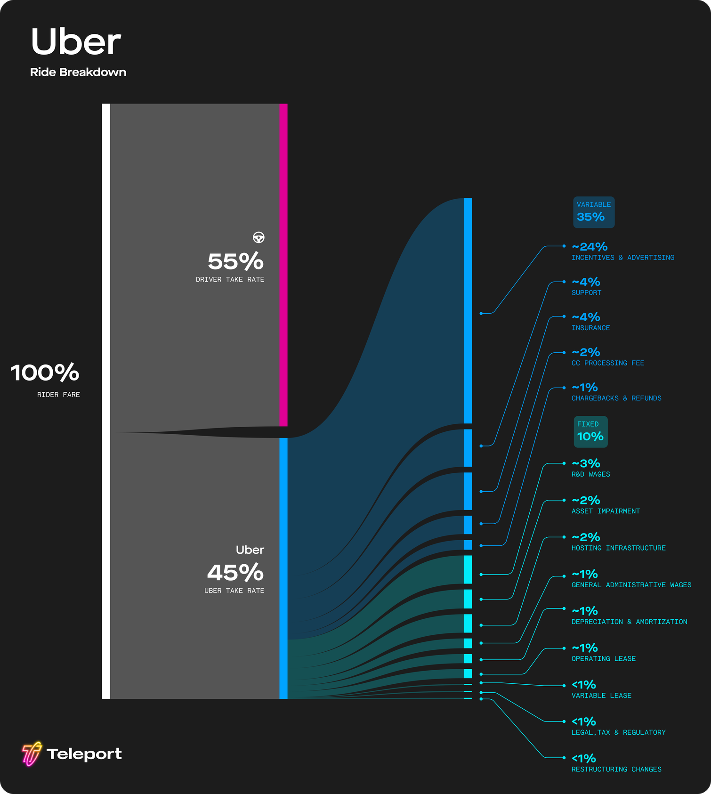
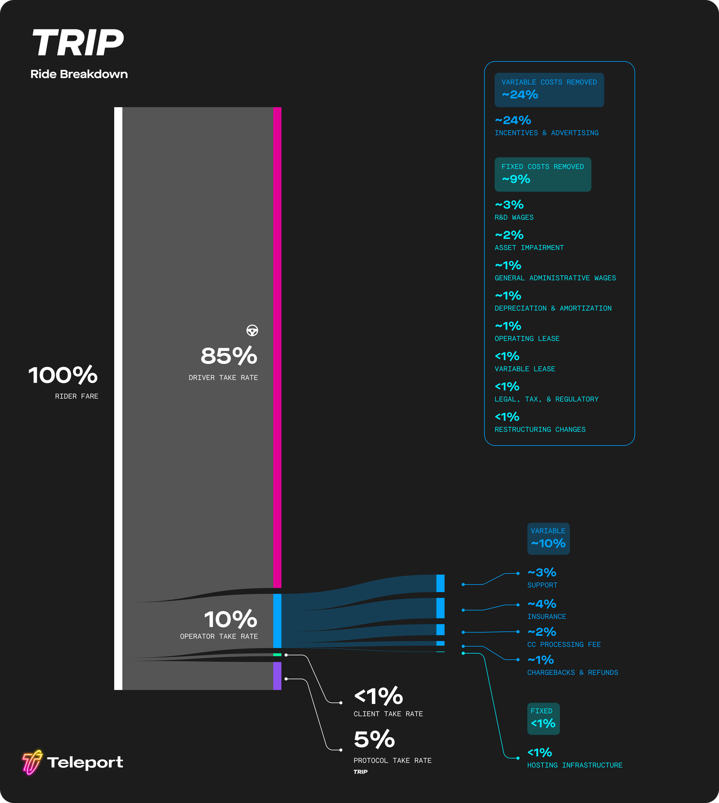
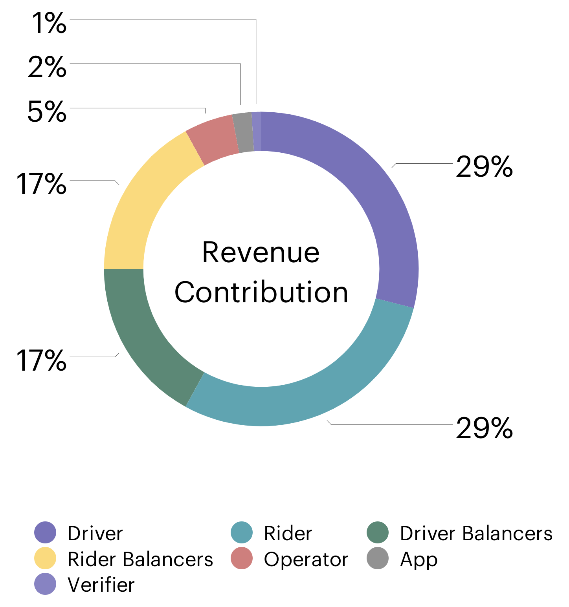
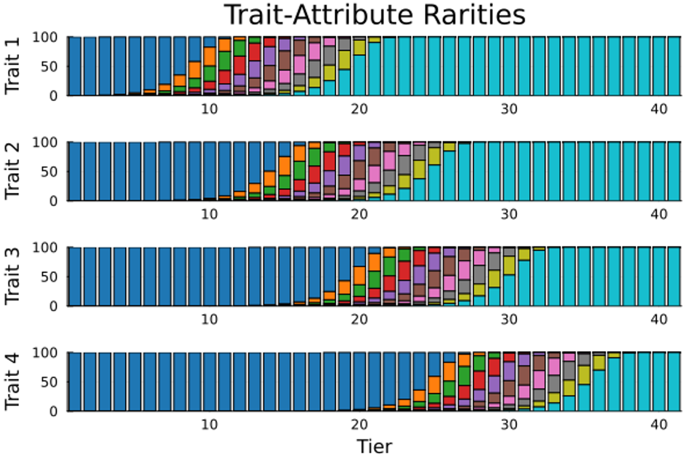
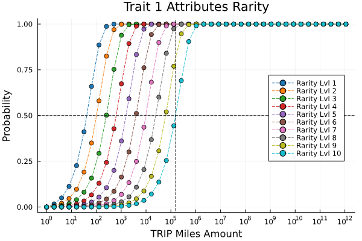
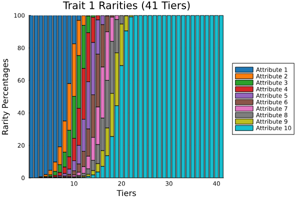
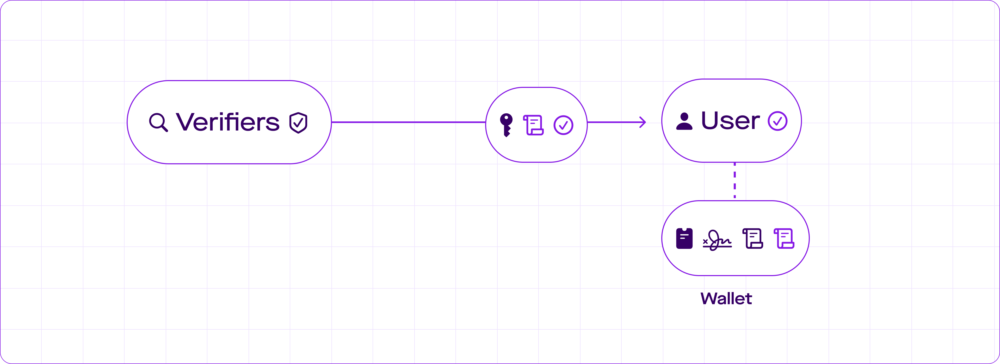

# Litepaper

## 1. Introduction

Rideshare is an intermediated industry with rideshare companies taking over 44% of fares on average.

This is because traditional ridesharing companies spend a lot on recruiting riders and drivers. This extra cost increases what riders pay for a ride and reduces what drivers take home.

This paper proposes an alternative approach. In this alternative approach, almost nothing is spent on recruiting. Instead, an open protocol (the TRIP Rideshare Protocol or **TRIP**) with onchain rewards is used to motivate current users to sign up new users.

This results in cost savings that are split between riders and drivers. In this system riders, on average, pay less and drivers, on average, earn a much higher percentage of the fare.

As a result, a freer and more fair rideshare emerges that benefits riders and drivers while opening up avenues for entrepreneurs to build businesses and innovate. This paper will explore in detail exactly how the TRIP Rideshare Protocol works.

## 2. Design 

The operation of the decentralized rideshare network involves the following entities:

1. **Riders** and **Drivers** connect to the protocol to offer or request rides using **Developer** Apps.
2. **Operators** handle the regulatory and operational requirements of providing rideshare service. They are powered by **Rideshare Server** software. Depending on the applicable local regulatory framework, an Operator may serve as Transportation Network Company (TNC) or Transportation Network Provider (TNP) or Fleet Manager.
3. The **TRIP Marketplace** consists of a set of blockchain smart contracts that offer coordination and consensus services to the rideshare network. These smart contracts are governed by a Decentralized Autonomous Organization (DAO) and help the network remain neutral and fair without having to rely on centralized authority.
4. **Ambassadors** (aka Balancers) help the TRIP Marketplace overcome supply/demand imbalances by inviting additional Drivers and Riders to the protocol.
5. **Verifiers** inspect driver licenses, perform car inspections, conduct background checks and verify phone numbers.
6. **Auditors** confirm the legal and operational readiness of both Verifiers and Operators.

Once verified, any entity that is capable and legally permitted of performing a role can fulfill that role within the system.

When at least one Operator and enough Verifiers have been approved to operate within a specific geographic area, the TRIP protocol is considered live in that area.

### 2.1 Ordering a Ride

When ordering a ride, Operators validate that Drivers and Riders have passed all necessary checks, while Drivers and Riders validate that the Operator has been approved for operation in the region.

This mutual validation process helps ensure that rides established via TRIP are legal and insured, and that Drivers and Riders are vetted.

### 2.2 Supply & Demand Indication

Once Drivers are connected and validated by a local Operator, they can indicate that they are available to accept rides (supply indication). After going active, the Driver's App regularly updates the Driver's location with its active Operator.

Similarly, Riders can indicate that they are in need of a ride (demand indication).

### 2.3 Matching & Pricing

.png>)

When an Operator with active Drivers receives a ride request from a Rider it checks the location of nearby Drivers and uses its internal pricing engine to prepare an offer both to Drivers and to the Rider. Offers include both pricing and ETA estimates.

Drivers get offers only from their active Operator, but Riders get offers from all validated and licensed Operators in the geographic area. The pricing offered to both Drivers and Riders need to be mutually accepted before a trip is established. All pricing information and the take-rate of all roles involved is fully transparent to all participants.

### 2.4 Service Area

Both Riders and Drivers can connect to all Operators that are licensed to operate in or near their current geographic region.

Depending on local insurance, regulatory, and practical requirements, Drivers can be online with one or more Operators at the same time. Drivers can further instantly deactivate their active status with one Operator and switch to another. The specific policy and triggers for switching are up to the App, but most handovers are expected to happen organically without user intervention.

For example, automatic switching from one Operator to another can occur when crossing state or country lines. Once the Driver app crosses a service area border, the App will automatically become active with Operators licensed in the newly entered state or country.

In the United States the Interstate Commerce Clause (Article 1, Section 8, Clause 3 of the U.S. Constitution), the Full Faith and Credit Clause (Article 4, Section 1), and the Real Interstate Drivers’ Equity (RIDE) Act (48 U.S.C. 14501(d)) ensure that Drivers can drop off customers in states other than the one where the initial pick-up contract was established.

### 2.5 Payment

When booking a ride, Riders pay with traditional payment methods like credit card, debit card, Apple Pay, or stablecoins like USDC.

Drivers, and all other roles that receive a payout from the ride, receive payment in USDC. Drivers who wish to withdraw stablecoins to their bank account can utilize a licensed money transmitter right from their mobile app to do so.

### 2.6 Ride Conclusion

At the end of a ride, the Driver, and all other roles that receive a payout from the ride, receive their payments.

Both the Rider and Driver Apps report information, including the estimated time of arrival (ETA) and actual ride time, back to The TRIP Marketplace. The TRIP Marketplace can use this information to ensure that Operators provide accurate ETA estimates.

The Operator is fully responsible for compliance with local legal requirements around the collection and reporting of trip data points (such as pick-up/drop-off location, total fare, time of booking, number of passengers, wheelchair accessible requests and fulfillments). This is only necessary in jurisdictions where local law or regulation requires such reporting.

Driver, Rider, and Operator ratings are optionally reported to a rating aggregation service.

### 2.7 Dispute Resolution

Operators are responsible for the trips they facilitate and are legally required to conduct background checks on Drivers before facilitating a match. The TRIP protocol enforces this by ensuring that the Operator and Driver are both licensed, insured, permitted to operate in their geographic target area, and have passed a background check.

Operators who operate using the TRIP protocol are subject to the same requirements as any other rideshare operator. This includes full compliance with all applicable local regulations and laws, handling customer support requests, and cooperating with law enforcement. Operators also have the final say in resolving disputes and issuing refunds, in compliance with applicable laws and regulations.

To join the protocol, Operators must establish mechanisms for registering and responding to customer requests and complaints. This process is validated by dedicated auditing firms that review Operator applications before authorizing them for the protocol.

Operators that underdeliver on customer support, provide bad estimated times of arrival (ETAs), or are negligent of their duties to comply with safety regulations and ensure the well-being of Drivers and Riders will be penalized by the TRIP Marketplace or even removed from the protocol.

Increased competition, closely tracked ratings, and enforcement of high standards by The TRIP Marketplace compel Operators to deliver higher-quality service. If an Operator fails to do so, Riders and Drivers can and will move to alternative Operators they can choose from.

## 3. Marketplace Economics

Marketplaces enable direct competitors to benefit from cooperation with each other. It is no coincidence that in many cities, restaurants of the same cuisine and stores with similar wares cluster together and form neighborhoods. Although these shops still compete on price, selection, and quality of goods and services, they all benefit from increasing foot traffic to their area by working together.

Bringing open marketplace technology to rideshare will unlock the advantages of cooperation for all market participants:

* Drivers receive fairer pay and better treatment.
* Riders enjoy better prices, faster rides, and a wider selection of options.
* Regulators have increased ability to positively influence the local transportation market.
* Regional markets retain more money in their local economies.
* Entrepreneurs and businesses have more opportunities to build and innovate on top of transportation infrastructure.

### 3.1 Network Effects and Competitive Moats

When a networked service starts gaining users, its value proposition becomes stronger: more drivers on a rideshare app mean shorter wait times for riders, while more riders mean higher chances of drivers finding a fare nearby. This positive feedback loop is called a _network effect_, and it can fuel rapid growth of a new service.

This strength can also become a _moat_, deterring new entrants from competing in the same space. If a new rideshare service starts up, it'll struggle to attract enough drivers and passengers to achieve the same level of service efficiency unless it heavily invests in incentives to quickly build its user base.

Understanding how network effects are built was key to first building out the digital frontier. However, now that many markets have matured, it has become even more important to understand how network effects can be broken.

### 3.2 Habit and Brand Recognition

Habit, brand recognition, and trust can create strong barriers to entry on their own, but they do not represent good examples of network effects. In the absence of a network effect, a formerly unknown but superior product with better customer experience and/or cheaper prices can still become a competitive threat by first serving a subgroup of users to build trust and brand recognition and then expanding from there.

A moat in the network effect sense requires an advantage that doesn’t derive from the relationship of an individual with the product, but from advantages a service can only garner from having a larger number of users.

For users, the immediately tangible effects of network effects present in just two dimensions:

1. Unit economics: The ability to provide the service more efficiently than smaller competitors,
2. Customer experience: The quality of the service experienced by users is higher than can be provided by smaller competitors.

A moat only protects the incumbent if there is no "bridge": a contiguous and growing set of users that the upstart can serve better than the incumbent, despite its originally smaller size.

### 3.3 Your Margin is my Opportunity

While network effects provide the incumbent with an advantage, operational inefficiencies can negate these advantages. Such operational inefficiencies can include:

* A large headcount in the tens of thousands.
* Excessive corporate debt.
* High customer and driver acquisition cost.

These unfavorable conditions are present in current rideshare incumbents.

<figure><figcaption>
Cost structure of rideshare on legacy rideshare services.
</figcaption></figure>

In[ TRIP Rideshare Economics 101](https://guides.trip.dev/newsletter/rideshare-economics-101) we further explore how the fares differ between legacy rideshare and the TRIP rideshare protocol.

If a new system could establish itself with an initial audience and then grow, its higher operational efficiency would quickly become a threat to the established competition. As the new system grows, the relative advantage of the competition's network decreases, while its disadvantage in operational efficiency remains. This destructive cycle can rapidly become fatal for the outmaneuvered incumbent.

A market-operated rideshare network would be able to operate far more efficiently than current rideshare incumbents, in part because driver and rider acquisition cost could be lowered dramatically by turning all network participants into true entrepreneurs. This will result in better pay for drivers and lower costs for riders.

### 3.4 Building the Bridge

Rideshare companies have fought long and hard to classify their drivers as independent contractors rather than employees. Although drivers theoretically have the freedom to work for other rideshare companies or multiple networks, in reality, network effects have kept them locked into the dominant platform.

If all drivers and riders were to switch services at the same time, they could transition to a more free and fair system. However, such coordination has often been considered impossible.

<figure><figcaption>
Cost structure of rideshare on The Rideshare Protocol (TRIP).
</figcaption></figure>

What has been missing is a mechanism to coordinate this switch. We call a tool to enable such decentralized social coordination a "Bridge," because it can overcome the moat of a network effect.

Instead of attempting to convince everyone to switch at the same time, a bridge provides an opportunity for those who switch first to help build and take on a larger role in the network.

A rideshare marketplace that is fairer, with the participants - not middlemen - in control, is not just a better system. It also has the potential to become a social movement and spread like one.

## 4. TRIP Miles

<figure><figcaption></figcaption></figure>

TRIP Miles are non-transferable, non-monetary reward points that network participants receive by contributing to the network.

TRIP Miles can be used to claim TRIP Rewards which will be explained in Section 5.

### 4.1 Proof-of-Ride

One way that users can receive TRIP Miles is by facilitating rides on the network. These contributions are represented in terms of network revenue to account for variability in rides. Network revenue is gross bookings or total customer spend.

### 4.2 Network Revenue Contribution

Since multiple parties participate in facilitating each ride, revenue of a given ride is considered contributed by participants as follows:

<figure><figcaption></figcaption></figure>

Note: Drivers contribute 29% of the fare for the purpose of distributing TRIP Miles. This 29% contribution is separate from how much of the fare (on average 85%) the driver earns.

### 4.3 Competition Miles Allocation

TRIP Miles are allocated to competition participants in proportion to how much network revenue each participant contributed during a competition as described in section 4.2.

Initially the competition is held every minute and 1,793,868.232224 TRIP Miles are split across all network participants who facilitated rides that ended during this minute.

As network activity increases the allocation interval will increase and the TRIP Miles issuance adjusts along with it. For example when the competition is held every 10 minutes then 17,938,682.32224 TRIP Miles will be split across all network participants who facilitated rides that ended during these 10 minutes.

While rider and driver contributions are considered equal for an individual ride, drivers typically receive more TRIP Miles due to completing more rides.

### 4.4 Balancing Supply and Demand

#### 4.4.1 Competition Rollover

When a competition has no rides, its TRIP Miles are rolled over to the next competition, increasing the TRIP Miles pool up to a 180x multiplier and until a ride occurs. This balances supply and demand by incentivizing rides at off-peak times.

#### 4.4.2 Network Growth Incentives

Inviting riders and drivers is incentivized. Invited users must actively participate for their inviters to receive TRIP Miles. TRIP Miles are allocated up the invite chain which encourages quality referrals.

## 5. TRIP Rewards

<figure><figcaption></figcaption></figure>

TRIP Rewards are digital collectibles on The Rideshare Protocol (TRIP).

They are issued as non-fungible tokens (NFTs) on the Solana blockchain and commemorate network activity.

### 5.1 Reward Traits and Attributes

Each TRIP Reward has various traits such as vehicle, vehicle style, location, and mascot. Within each trait are multiple attributes. For example, vehicle includes supercar, motorcycle, and spaceship. Attributes of higher levels are rarer than attributes of lower levels.

<table><thead><tr><th>Level</th><th>Vehicle</th><th width="131">Style</th><th>Location</th><th>Mascot</th></tr></thead><tbody><tr><td>0</td><td>Sled</td><td>Ice</td><td>Iceberg</td><td>Baby Penguin</td></tr><tr><td>1</td><td>Supercar</td><td>Cyberpunk</td><td>Megalopolis</td><td>Baby Raccoon</td></tr><tr><td>2</td><td>Motorcycle</td><td>Art Deco</td><td>Desert</td><td>Baby Giraffe</td></tr><tr><td>3</td><td>Submarine</td><td>Coral</td><td>Underwater</td><td>Baby Octopus</td></tr><tr><td>4</td><td>Helicopter</td><td>Fire</td><td>Volcano</td><td>Baby Dragon</td></tr><tr><td>5</td><td>Hot Air Balloon</td><td>Wonderland</td><td>Sugar Candyland</td><td>Baby Bunny</td></tr><tr><td>6</td><td>Jetpack</td><td>Futuristic</td><td>Mars Colony</td><td>Baby Squirrel</td></tr><tr><td>7</td><td>Airplane</td><td>Origami</td><td>Vaporwave Beach</td><td>Baby Owl</td></tr><tr><td>8</td><td>Speedboat</td><td>Prehistoric</td><td>Dinosaur Park</td><td>Baby Dinosaur</td></tr><tr><td>9</td><td>Spaceship</td><td>Fantasy</td><td>Fairytale Fantasy World</td><td>Baby Shiba Inu</td></tr></tbody></table>

### 5.2 Reward Tiers

TRIP Rewards are classified into tiers numbered from 1 to 41. Higher tier TRIP Rewards have rarer attributes on average.

The TRIP Miles needed to advance from one tier to the next doubles. So, Tier 1 rewards can be claimed with 1 TRIP Mile, while Tier 2 with 2, Tier 6 with 32, Tier 11 with 1024, and so on.

<figure><figcaption>
Each colored bar represents the percentage chance an attribute of a given trait occurs at a specific tier.
</figcaption></figure>

### 5.3 Claiming TRIP Rewards

<figure><figcaption></figcaption></figure>

TRIP Miles determine the tier of the TRIP Reward that can be claimed. When claiming a TRIP Reward using TRIP Miles always the highest tier available is claimed. Leftover TRIP Miles can be used to claim additional lower tier TRIP Rewards.

The Solana blockchain might charge nominal gas fees for the minting process, but it is expected that various entities participating in the protocol will choose to serve as payer for those fees while managing the number of claims available to a user each day. The protocol's sybil protection fee could also be utilized to pay network gas for users.

### 5.4 Attribute Rarity

To select attributes for a trait, a random number is drawn and compared against the probability criteria for each attribute in decreasing rarity (Attribute 9 → Attribute 0) until the random number is less than the probability value.

The more TRIP Miles are provided during a TRIP Rewards claim, the higher the likelihood that a rarer attribute will be selected. This is accomplished via a rarity function that varies from 0-1 depending on the amount of TRIP Miles provided. Providing more TRIP Miles pushes the rarity function’s value closer to 1, which means closer to a 100% chance of an attribute at least that rare being selected.

The probability selection criteria for trait $$i$$, attribute $$j$$, with respect to TRIP Miles, $$M$$ is defined as:

$$
p_{ij}(M) = 1 - 2^{-\left( \frac{1}{Q_i} + \frac{M-1}{A_{ij}} \right)}
$$

where subscripts $$i$$ and $$j$$ are 1-based index.

**Within each trait's set of attributes** $$i$$, the rarity functions are parameterized by:

* a common value $$Q_i$$
* a distinct value $$A_{ij}$$ for each attribute $$j$$

The $$A_{ij}$$ parameter is defined based on an exponential decay relative to the $$Q_i$$ value, and increases by a factor of 2.5 with increasing attribute level $$j$$.

$$A_{ij} = 0.99 \cdot 2.5^{j - N_{a,i}} \cdot Q_i$$

where $$N_{a,i}$$ is the number of attributes within the trait $$i$$

For example, in trait 1:

* $$Q_1=156,250$$
* $$A_{1j} = 0.99 * 2.5^{j-N_{a,1}} * Q_1$$

$$Q_1=156,250$$ means that providing 156,250 TRIP Miles is more than enough to give the user a 50% chance at achieving the rarest attribute in trait 1.

The $$A_{1j}$$ parameter now increases by a factor of 2.5 with increasing attribute number within trait 1's set of attributes, ending at 0.99 of $$Q_1$$.

The way $$A$$ and $$Q$$ vary for trait 1 staggers sigmoid (S-shaped) probability curves for each attribute, with the most common attribute starting at the lower end of the tier spectrum, and the most rare attribute ending at the upper end of the tier spectrum.

<figure><figcaption>
Staggered sigmoid-like probability curves for each attribute in trait 1.
</figcaption></figure>

 

<figure><figcaption>
Rarity distribution of trait 1 attributes as a variation of TRIP Rewards tier.
</figcaption></figure>

Across each trait's set of attributes, $$Q_i$$ increases by a factor of 40 with increasing trait $$i$$, indicating the increasing relative rarity with increasing trait index.

$$
Q_i = 1.0 \times 10^{10} \cdot 40^{i - N_t}
$$

where:

* $$N_t$$ is the number of traits, with $$N_t = 4$$ for TRIP Rewards.
* $$i$$ is the trait index

Once attribute levels have been selected for all of the traits, the selected attribute levels are shuffled between the traits. This maintains the design principle where higher tiers have rarer traits, while introducing more attribute variation in the final collection of TRIP Rewards.

## 6. Architecture

All entities (Riders, Drivers, Operators, etc) on the network are uniquely identified by a public/private key pair that they self-generate.

Entities use their keys to identify themselves, authenticate connections, sign messages, and store USDC and other digital tokens, as well as certificates associated with their public key.

When two entities establish a direct network connection, they use their keys to establish an encrypted and mutually authenticated session. The session is protected against impersonation, man-in-the-middle, and replay attacks.

### 6.1 Attestations

Entities can make statements about each other by signing statements about the public keys of other entities. These statements can be made either onchain or off chain.

### 6.2 The TRIP Marketplace

The TRIP Marketplace is a set of smart contracts that run on a blockchain. It provides consensus, coordination, and governance services for all other components of the rideshare network.

### 6.3 Network Authorization

.png>)

In order to comply with legal and regulatory requirements, maintain high safety standards, and ensure customer satisfaction, all rideshare network participants must undergo an authorization process appropriate for their role before being granted access to the network.

The governance of the TRIP Marketplace has the authority to temporarily and revocably delegate the authority to make attestations to dedicated Auditors and Verifiers.

An Auditor is a firm or individual authorized by the governance of the TRIP Marketplace to verify that Operators and Verifiers are legally permitted and operationally capable of fulfilling their assigned roles on the network.

A Verifier is a service or entity that validates claims or assertions made by users or entities within the decentralized ecosystem. Verifiers play a crucial role in establishing trust and credibility when traditional centralized authorities are not present.

#### **6.3.1 Onchain Authorization**

Verifiers must be in legal and operational compliance with all applicable regulations and laws before they begin providing attestation services to the network.

Operators must obtain licenses and insurance, and be operationally prepared to comply with regulatory and safety requirements in each geography they wish to serve, before they can begin matching riders and drivers within those locations.

To ensure that Verifiers and Operators are compliant with local regulation and operational requirements, the TRIP Marketplace deputizes dedicated auditing firms. These firms receive authorization by multi-sig keys to sign off on the regulatory and operational readiness of Operators and Verifiers.

Once Operators and Verifiers have been approved they are publicly listed on the contract together with their public key and DNS address, as well as additional metadata such as geographic zones of operation.

#### **6.3.2 Certificate-Based Authorization**

While Operators and Verifiers are authorized on the blockchain, drivers and riders (users) are authenticated off-chain to preserve privacy and control.

After a Verifier has completed the certificate-based authorization flow, the user's rideshare app receives certificates that they can use to prove their authorization with a high level of precision and control. Types of authorizations include background checks, driver licenses, car inspections, and any other credentials required for legal operation.

For example, if a user’s rideshare app requires a certificate to prove that its phone number has been verified, they can contact a Verifier capable of providing that service. After the usual public key-based handshake described earlier, the Verifier then sends a text message with a code to the user’s phone number.

After the user enters the correct code in either the ride share app or on a dedicated website, the phone number Verifier confirms that the phone number has been verified by transmitting two signed certificates to the user’s rideshare app:

1. A signed certificate stating that “\<Verifier PubKey> has established on \<Date> that \<User PubKey> has a valid phone number.”
2. A signed certificate stating that “\<Verifier pubKey> has established on \<Date> that \<User PubKey> has a valid phone number, and that this phone number is +1 (415) 000-9999.”

Having received two separate certificates, the user’s app is now in a position to choose whether to prove that their phone number has been verified, or that a specific phone number has been verified for their use, without having to resort to Zero Knowledge Proof techniques. Certificates have an expiration date and can be revoked through a certificate revocation list.

The user is now verified through the Verifier and can prove to any other entities that their phone number has been verified, without needing to disclose the phone number to other protocol participants.

### 6.4 Payment Rails

Payments on the rideshare protocol (TRIP) are made using national currencies, such as the US dollar. The system - as much as is possible - supports both traditional payment methods such as credit cards and bank transfers, as well as newer payment methods like stablecoins backed by national currencies.

### 6.5 Sybil Protection Fee

In protocol design, a sybil attack is an attempt by an individual to manipulate the network by creating multiple fake identities or transactions.

The TRIP protocol requires a 5% sybil fee to be paid to the TRIP Marketplace on every transaction on the network. Transactions are conducted in national currency stablecoins as discussed in previous sections.

The TRIP Marketplace holds the Sybil fee, to be exclusively controlled by the network's governance (using TRIP Tokens).

In future iterations of the protocol, the USDC Sybil fee could also potentially be used to finance the transaction fees for the blockchain the protocol utilizes, as well as to facilitate the payment of various other blockchain operations.

### 6.6 Privacy

TRIP's architecture is carefully designed to select which data is transmitted to which party and where control over the data is located. Data is only shared with the minimum subset of recipients required for legal, safety, and technical reasons.

Transaction and identity-related data never come into contact with a blockchain or any other public repositories. Payments do occur on the public ledger but contain no information about destinations beyond what any normal blockchain payment would reveal.

The public nature of ledger technologies is known to have privacy implications, which have been thoroughly studied and researched. It is possible and reasonable to reduce information leakage from blockchain transactions in the future by introducing privacy-enhancing Zero Knowledge technologies, and we do believe that this will be an important addition to future protocol versions.

## 7. Conclusion

In this paper, we’ve introduced **TRIP**, The Rideshare Protocol, an open and decentralized alternative to centralized rideshare services that's safe, reliable, and capable of complying with local and national regulations.

We welcome feedback and contributions and are looking forward to the launch of the first TRIP services, servers, and mobile apps.


**Feedback**

You're encouraged to help improve the quality of this guide.

Please contribute if you see any typos or factual errors. To get started, you can read our [Contributing to the TRIP Guides](../contributing/contributing-to-trip.md) section.

You may also find incomplete content or stuff that is not up to date. Please do add any missing content by [creating a free account in GitBook](https://app.gitbook.com/invite/0WSd8UiSeH2xhfJrSbUr/YFiygcuBiy7oN3WJyDRs).

If for whatever reason you spot something to improve but cannot do it yourself, please [open an issue](https://github.com/TeleportXYZ/TRIP-Guides/issues/).

And last but not least, any kind of discussion regarding TRIP documentation is very welcome in the [official TRIP Community on Telegram](https://trip.dev/chat).

